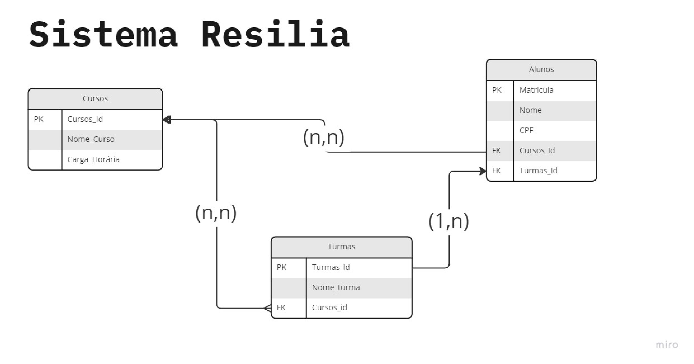

# Sistema_Resilia

Projeto Individual do Módulo 4 do curso de Desenvolvimento Web da Resilia Educação. A proposta é modelar um banco de Dados para um novo sistema de acompanhamento, suas entidades de armazenamanto são: Cursos, Turmas e Alunos.

 

Segue abaixo a representação gráfica do modelo com as tabelas e seus atributos:

 

  

    
  

   
<h2>- Perguntas sobre o Modelo.</h2>
 

Abaixo apresento algumas respostas acerca da apresentação.

 
<h3>Existem outras entidades além dessas três?</h3>

Sim. É possível compor o banco de dados com entidades como: Facilitadores, Soft, Tech, Módulos etc.

  
<h3>Quais são os principais campos e tipos?</h3>
 

Principais campos da entidade cursos, e seus tipos, são:
 - Cursos_Id: chave primária, não nula.
 - Nome_Curso: Caractere de tamanho variável definido para 60 dígitos, não nulo.
 - Carga_Horaria: Campo de atribuição de número real, não-nulo.

  

Principais campos da entidade turmas, e seus tipos, são:
 - Turmas_Id: chave primária, não nula.
 - Nome_Turma: Caractere de tamanho variável definido para 60 dígitos, não nulo.
 - Cursos_Id: Chave estrangeira relacionada a entidade cursos.

  

Principais campos da entidade alunos, e seus tipos, são:
 - Mátricula: chave primária, não nula.
 - Nome: Caractere de tamanho variável definido para 60 dígitos, não nulo.
 - CPF: Caractere do tipo CHAR definido para 11 digitos, não nulo.
 - Cursos_Id: Chave estrangeira relacionada a entidade cursos.
 - Turmas_Id: Chave estrangeira relacionada a entidade turmas.

  
<h3>Como essas entidades estão relacionadas?</h3>

A entidade curso contém muitas turmas e muitos alunos. Para uma entidade turma existe uma quantidade limitada de alunos.

 
<h3>Requisito Extra:</h3>

Como requisito extra do projeto foi realizado um script para a criação do banco de dados proposto, é possivel acessá-lo no caminho: src -> sql.
